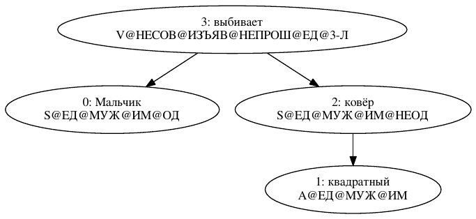

### DESCRIPTION
This is D bindings for Coda - NLP stack for Russian and English languages.

Russian example:
"Мальчик квадратный ковёр выбивает."

### BUILDING AND INSTALLATION
Just follow instructions on Coda site:
https://github.com/zy4kamu/Coda

### USAGE
For usage example see "unittest" section
